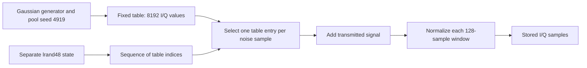

# Reproduce the noise evidence

This walkthrough reproduces the noise evidence used to select the historical
software family: the runtime control, candidate-pool comparisons, sample-to-pool
matching, and the random-index recurrence check. It uses the **original released
pickle**, not a dataset made by the patched reproducible generator.

## What is being matched?

The historical noise source does not generate a new Gaussian value for every
output sample. It first generates a **pool of 8,192 complex values**, then
repeatedly chooses entries from that pool, with replacement. A complex value is
an I/Q pair: picture it as an arrow whose direction is its phase and whose
length is its magnitude.

Two different random processes are involved:



The pool comparison tests which table explains the stored samples. The
recurrence check tests whether the recovered table indices follow historical
`lrand48` draws. Matching the table alone does not establish the draw sequence.
A pool index is a zero-based CSV row number, not a sample time or a seed.

We start with the `('AM-SSB', -20)` array: 1,000 windows of 128 complex
samples, with I and Q stored in separate rows, for 128,000 complex samples
altogether. This particular signal path multiplies by a real sine at zero
frequency. Mathematically that multiplier would be zero. The historical
implementation leaves tiny nonzero leakage. At this SNR label the noise
dominates sufficiently for all these windows to fit the noise-pool model below.
This does **not** mean that every modulation at low SNR is pure noise, or that
AM-SSB contains exactly zero signal.

The original generator divides each window by `sum(abs(window))`. It does not
use squared energy or RMS, despite its comment about energy. This positive,
common divisor changes every arrow's length by the same factor and leaves its
direction unchanged. Thus the model for one stored window is:

```text
z[n] approximately equals c * p[j[n]],       n = 0,...,127

z[n] = stored complex sample
p[j] = entry j in the candidate pool
j[n] = unknown pool index for sample n
c    = one common positive scale for the entire window
```

The scale absorbs both the noise amplitude and the window's normalization.
The small residual includes source leakage and floating-point rounding. The
matching code does not fit a phase rotation, a time shift, or a separate gain
for every sample. For example, if a candidate value is `-1.4 - 0.4i`, multiplying
it by a small positive scale can explain a stored value near `-0.014 - 0.004i`;
it cannot explain a value pointing in a different direction.

## How the pool matcher works

[audit_rml2016.py](../scripts/audit_rml2016.py) performs these operations for
each candidate pool:

1. **Compare directions.** Divide each observed sample and pool entry by its
   own magnitude. For each observed unit arrow, find the closest pool unit
   arrow. This is a nearest-neighbor lookup over the 8,192 entries, implemented
   with SciPy's `cKDTree`.
2. **Estimate a common scale.** For each window, take the median of the 128
   ratios `abs(observed sample) / abs(selected pool entry)`. Some entries have
   almost the same direction but different lengths, so phase matching alone
   can choose an incorrect index.
3. **Refine using lengths as well as directions.** Divide the observed window
   by its current scale and find the nearest full I/Q pool points. Refit a
   single least-squares scale using those 128 chosen points. Repeat this
   lookup-and-refit pass three times.
4. **Measure the remaining error.** Compare the stored window with the selected
   pool points multiplied by the final scale. Only a pool that explains the
   whole window with one scale has a small waveform error.

The two reported errors are different quantities:

```text
phase distance for sample n:
    min over j of abs(z[n]/abs(z[n]) - p[j]/abs(p[j]))

scale update for a window, after choosing indices j[n]:
    c = sum(Re(z[n] * conjugate(p[j[n]]))) / sum(abs(p[j[n]])**2)

relative waveform error for a window:
    sqrt(sum(abs(z[n] - c*p[j[n]])**2)) / sqrt(sum(abs(z[n])**2))
```

Phase distance is a dimensionless **chord length on the unit circle**, not an
error in the raw I/Q values or an angle computed in radians. The phase
statistics come from the initial direction-only lookup. Exported indices come
from the last full-I/Q lookup, followed by the final scale fit. The code does
not run another lookup after that fit. The fitted scales are positive for the
reported matching data, although the least-squares formula itself is
unconstrained.

All 128 samples participate in fitting and scoring each window. These are
reconstruction checks on observed data, not predictions of withheld samples.

## 1. Enter the historical environment

The scripts need the original dataset supplied separately and the historical
Docker image. Use a trusted pickle because Python pickle loading executes
serialization instructions. A changed input hash means that you are examining a
different file, even if it has the same filename.

Run these commands **on the host, from a recursive repository checkout**. Set
`RML_PICKLE` to an existing absolute path. Docker's `--mount` rejects a missing
source file.

```sh
RML_PICKLE=/absolute/path/to/RML2016.10a_dict.pkl
mkdir -p output/evidence
docker build --platform linux/amd64 -t radioml2016:historical .
docker run --rm -it --network none --user "$(id -u):$(id -g)" \
  -e HOME=/tmp -e PYTHONDONTWRITEBYTECODE=1 \
  -v "$PWD:/work:ro" -v "$PWD/output/evidence:/out" \
  --mount "type=bind,src=$RML_PICKLE,dst=/data/original.pkl,readonly" \
  -w /work radioml2016:historical /bin/bash
```

**Run all subsequent commands inside that container until the final `exit`.**
`/work` is the read-only checkout, and `/out` is the host's `output/evidence/`.
The container supplies GCC, Boost headers, Python 2.7, NumPy, and SciPy. The
Python evidence scripts also support Python 3 with NumPy and SciPy, but using
this image fixes the compiler and library choices for the documented results.

Verify the input and candidate runtime:

```sh
sha256sum /data/original.pkl
python2.7 scripts/check_historical_runtime.py --output /out/runtime.json
python2.7 -m json.tool /out/runtime.json
```

The reference pickle's hash is
`b29ccc25b00d0718cd3b70ffa9158662ec83f6d9b63ffd845c7bcbe3b3096e8c` and its size
is 640,919,653 bytes. The audit below also records its hash, shape, and type:
220 keys, each with `(1000, 2, 128)` float32 values.

The runtime check should report BPSK mapper `peak: 1.0`, sine-at-zero bits
`0x31f80cb5`, and `fastnoise.checked_samples: 4096`. It compares actual GNU Radio
noise samples with the independent pool and a known `lrand48` sequence after
`srand48(0)`. **That zero seed is a controlled runtime test, not a recovered
original seed.** All eleven modulation checks must complete. The historical
MP3 decoder can print its known header warning while those checks pass. The
combined channel hash is allowed to vary because of the shared RNG.

## 2. Generate candidate noise pools

Compile the independent [pool generator](../scripts/rml2016_noise_pool.cc),
then produce the positive candidate and two negative controls:

```sh
c++ -O2 -std=c++11 scripts/rml2016_noise_pool.cc -o /out/noise-pool
/out/noise-pool mt 4919 > /out/mt-4919.csv
/out/noise-pool mt 5489 > /out/mt-5489.csv
/out/noise-pool nr 4919 > /out/nr-4919.csv
wc -l /out/mt-4919.csv /out/mt-5489.csv /out/nr-4919.csv
head -n 3 /out/mt-4919.csv
```

Each CSV has exactly 8,192 rows and two columns, `I,Q`, with no header. The
helper preserves the candidate's Gaussian arithmetic, complex scaling by
`1/sqrt(2)`, and GCC's observed I/Q evaluation order. It emits a unit-amplitude
pool. The fitted common scale accounts for the original amplitude and
normalization, up to the measured rounding residual.

| Candidate | Why it is included |
| --- | --- |
| `mt 4919` | Historical Boost-MT implementation with `0x1337`, the seed supplied by the released generator. This seed was obtained from the source, not an exhaustive search. |
| `mt 5489` | Same pool algorithm with the Boost MT default seed. This controls for the supplied pool seed without simulating the full later channel implementation. |
| `nr 4919` | Earlier GNU Radio Numerical Recipes implementation with the supplied channel seed. Its legacy initialization maps nonnegative supplied seeds to internal seed 1. |

These candidates have similar Gaussian distributions. Comparing **specific
generated values** distinguishes their pools. Different compilers or replacing
the old mixed float/double expressions can change the pool. The supplied helper
and historical image make those choices explicit.

## 3. Compare all candidate pools with the original samples

```sh
python2.7 scripts/audit_rml2016.py /data/original.pkl \
  --modulation AM-SSB --snr -20 \
  --pool mt-4919=/out/mt-4919.csv \
  --pool mt-5489=/out/mt-5489.csv \
  --pool nr-4919=/out/nr-4919.csv > /out/pool-comparison.json
python2.7 -m json.tool /out/pool-comparison.json
```

`AM-SSB` and `-20` are also the script defaults. Candidate labels are names you
choose for the JSON report. They do not cause the script to assume a match. The
report records the pickle hash and each CSV's path and hash.

Expected results for the reference file are:

| JSON field within each pool | `mt-4919` | `mt-5489` | `nr-4919` |
| --- | ---: | ---: | ---: |
| `sample_count` | 128,000 | 128,000 | 128,000 |
| `phase_distance_below_1e-6` | 128,000 | 302 | 430 |
| `windows_below_1e-6_relative_error` | 1,000 | 0 | 0 |
| `relative_waveform_error_median` | about `4.32e-8` | about `0.0274` | about `0.0283` |
| `relative_waveform_error_max` | about `5.45e-8` | about `0.0905` | about `0.106` |

The 302 and 430 direction matches do not make the alternatives successful:
with 8,192 candidate directions, occasional close directions are unsurprising.
Neither alternative fits a single complete window to the waveform tolerance.
The correct candidate fits all 1,000. This supports the historical pool
construction and supplied seed among these alternatives, without uniquely
identifying a GNU Radio release.

### AM-SSB at +18 dB

The original AM-SSB windows remain overwhelmingly noise even at the highest
SNR label, +18 dB. Repeat the comparison inside the same container:

```sh
python2.7 scripts/audit_rml2016.py /data/original.pkl \
  --modulation AM-SSB --snr 18 \
  --pool mt-4919=/out/mt-4919.csv \
  --pool mt-5489=/out/mt-5489.csv \
  --pool nr-4919=/out/nr-4919.csv > /out/pool-comparison-amssb-18.json
python2.7 -m json.tool /out/pool-comparison-amssb-18.json
```

Results measured on September 15, 2026 with the same reference pickle and
historical image:

| JSON field within each pool | `mt-4919` | `mt-5489` | `nr-4919` |
| --- | ---: | ---: | ---: |
| `sample_count` | 128,000 | 128,000 | 128,000 |
| `phase_distance_below_1e-6` | 92,131 | 356 | 469 |
| `windows_below_1e-6_relative_error` | 984 | 0 | 0 |
| `relative_waveform_error_median` | about `8.63e-7` | about `0.0275` | about `0.0278` |
| `relative_waveform_error_max` | about `1.074e-6` | about `0.0843` | about `0.0892` |

Thus a noise-only model reconstructs all 1,000 +18 dB windows with roughly one
part per million relative waveform error. The residual is larger than at -20
dB, consistent with the tiny surviving signal becoming more visible as the
injected noise decreases. The residual also includes numerical rounding, so it
does not separately measure signal power or establish an actual SNR.

The source explains why the positive label does not rescue AM-SSB. The [real
zero-frequency sine](../transmitters.py) suppresses the signal to tiny
numerical leakage: the runtime check measures a sine multiplier of about
`7.22e-9` and an AM-SSB modulator output peak of about `1.52e-8` for its test
input. The [generator](../generate_RML2016.10a.py) sets the +18 noise amplitude
to `10**(-18/10)`, about `0.01585`, without measuring the weakened signal and
calibrating noise against it. Fading changes the signal's exact amplitude. The
later window normalization scales signal and noise together. **+18 dB is a
dataset label, not a measured SNR for this malformed AM-SSB path.**

The strict index-export gate remains `1e-6`: the 16 +18 dB windows above that
threshold cause `--indices` to refuse export for this key. Use the verified -20
dB indices for the recurrence walkthrough below. Its 220-window count describes
the -20 dB data.

## 4. Export the recovered pool indices

Export indices only for the matching pool:

```sh
python2.7 scripts/audit_rml2016.py /data/original.pkl \
  --modulation AM-SSB --snr -20 \
  --pool mt-4919=/out/mt-4919.csv --indices /out/indices.npy \
  > /out/matching-pool.json
python2.7 - <<'PY'
from __future__ import print_function
import numpy as np
indices = np.load('/out/indices.npy', allow_pickle=False)
print('shape:', indices.shape)
print('first six indices:', indices[0, :6].tolist())
print('index range:', int(indices.min()), int(indices.max()))
PY
```

The shape is `(1000, 128)`. The first six indices for the reference file are
`[5432, 2714, 5928, 7803, 364, 3010]`. Every index is in `0..8191` and refers to
a zero-based row of **this same CSV**, with no sorting or reordering of rows.
The first dimension is the stored window order, not an inferred burst number.

Export requires exactly one pool, and the script refuses to export if **any**
window has relative waveform error at least `1e-6`. For example, this negative
control must fail with `Pool does not match every window; refusing index export`:

```sh
python2.7 scripts/audit_rml2016.py /data/original.pkl \
  --pool mt-5489=/out/mt-5489.csv --indices /out/wrong-indices.npy
```

This command intentionally exits nonzero. Continue with the matching
`/out/indices.npy`. Do not substitute indices from a failed candidate. If an
old file exists at an output path, a failed command does not make that file a
valid result of the new run.

## 5. Test the order of the indices

Run the independent [recurrence probe](../scripts/probe_lrand48.py):

```sh
python2.7 scripts/probe_lrand48.py /out/indices.npy --examples 20 \
  > /out/lrand48.json
python2.7 -m json.tool /out/lrand48.json
```

`lrand48` is a deterministic random-number generator: once its internal state
is fixed, its next output is fixed too. We can therefore test candidate states
by predicting the next table index and comparing it with the recovered index.

For the historical Linux implementation, after each random draw:

```text
S_next = (0x5deece66d * S + 11) mod 2**48
lrand48 result = S_next >> 17
pool index = (S_next >> 17) mod 8192
```

The table index exposes only bits 17 through 29 of the 48-bit state. Higher
bits cannot affect it. The probe can therefore work with just the low 30 bits:

```text
x_next = (0x5deece66d * x + 11) mod 2**30
pool index = x_next >> 17
```

For each window, the first observed index fixes 13 bits of a candidate state
and leaves 17 unknown. The probe enumerates those `2**17 = 131072` possibilities,
advances each by one draw, and discards candidates that disagree with the next
index. It continues until the next index is impossible or all 128 agree. It
starts independently at every window: it does not assume consecutive draws
across gaps between stored windows.

| Report field | Meaning and expected result |
| --- | --- |
| `fully_consecutive_frames` | **220** windows admit one uninterrupted 128-draw sequence. |
| `prefix_length_histogram` | Counts the longest compatible prefix starting at sample 0 of each window. Key `"128"` has count 220; the other counts total 780. It does not search for compatible runs later in a window. |
| `frames_with_unique_prefix_start_state` | **784** windows have a unique low-30-bit state for their compatible prefix. Many of these prefixes stop before sample 128. |
| `examples[].conditional_initial_low30_state` | State producing the first index, **after that draw's update**, conditional on the reported uninterrupted prefix. It is not an original seed. |
| `examples[].conditional_zero_start_position_mod_2_30` | The state's position around the low-30-bit recurrence cycle relative to zero, modulo `2**30`. It is not an elapsed sample time or proof that the run began at zero. |

**All 1,000 windows fit the pool, while 220 fit an uninterrupted selection
sequence.** These are compatible findings. Other channel blocks used the same
process-global `lrand48` stream and could consume intervening draws. Index
ambiguity or RNG races can also spoil a recurrence match. A failed prefix
alone does not identify which explanation occurred. Very short compatible
prefixes can occur by chance, so a three-sample prefix has much less evidential
weight than a complete 128-sample window.

## 6. Inspect one complete worked example

The first reference window uses pool row 5432 for its first sample. One fitted
scale, about `0.00879867821951`, accounts for all 128 samples in that window:

| Sample | Pool row | Pool I,Q (rounded) | Stored I,Q (rounded) |
| --- | ---: | --- | --- |
| 0 | 5432 | `(-1.42327678, -0.43293336)` | `(-0.012522954494, -0.003809241112)` |
| 1 | 2714 | `(-0.565530896, -1.12231445)` | `(-0.004975924734, -0.009874883108)` |
| 2 | 5928 | `(0.130637705, 0.00742746331)` | `(0.001149439136, 0.000065351858)` |

Multiplying the pool pairs by that common scale reproduces the stored pairs up
to the small residual. The complete window's relative error is about `3.97e-8`.
Recompute the scale, compare samples, and check all 128 recurrence steps
directly:

```sh
python2.7 - <<'PY'
from __future__ import print_function
import cPickle
import json
import numpy as np

with open('/data/original.pkl', 'rb') as source:
    dataset = cPickle.load(source)
z = dataset[('AM-SSB', -20)][0].T.astype(np.float64)
pool = np.loadtxt('/out/mt-4919.csv', delimiter=',')
indices = np.load('/out/indices.npy', allow_pickle=False)[0]
p = pool[indices]
c = (z * p).sum() / (p * p).sum()
fitted = c * p
error = np.linalg.norm(z - fitted) / np.linalg.norm(z)
print('common scale:', c)
print('relative waveform error:', error)
for n in range(3):
    print('sample', n, 'pool row', int(indices[n]),
          'stored', z[n].tolist(), 'fitted', fitted[n].tolist())

with open('/out/lrand48.json') as source:
    example = json.load(source)['examples'][0]
assert example['frame'] == 0 and example['consecutive_prefix_samples'] == 128
x = example['conditional_initial_low30_state']
print('state producing first sample:', x)
for index in indices:
    assert (x >> 17) == int(index)
    x = (0x5deece66d * x + 11) & ((1 << 30) - 1)
print('All 128 indices follow consecutive draws from that low-30-bit state.')
PY
```

For this window, the first index permits 131,072 low-30-bit states, the first
two permit 16, and the first three leave one: `712033158`. That state produces
index 5432. The next two states, `355836953` and `777082032`, produce indices
2714 and 5928, respectively. The remaining samples agree too. The unknown upper
18 state bits and the run's original initialization are still unresolved. Pool
seed **4919**, this conditional state **712033158**, and a possible original
`srand48` argument are three different quantities.

## Results, other inputs, and troubleshooting

Finish the container session with:

```sh
exit
```

The host's `output/evidence/` now holds the compiled helper, three CSV pools,
`runtime.json`, `pool-comparison.json`, `pool-comparison-amssb-18.json`,
`matching-pool.json`, `indices.npy`, and `lrand48.json`. The CSVs are candidate
inputs to the matcher. The `.npy` file links waveform matching to the
recurrence probe. The JSON files are reports. These outputs are ignored by Git
and are not required source dependencies.

- If the input hash, keys, shape, or dtype differs, first establish which
  dataset you supplied. A repackaged pickle can have different bytes while
  retaining the same arrays. The reported scores are tied to the reference
  contents, not merely its filename.
- If the runtime control fails, verify that you used `radioml2016:historical`.
  The patched reproducible image intentionally changes the selector state and
  will fail the historical `srand48(0)` sample comparison. An alternative mapper
  image needs the corresponding `--mapper-amplitude` and `--pam4-amplitude`
  settings.
- If the positive pool fails, compare its CSV hash, compiler/image, input data,
  and I/Q column order. The audit records the candidate hashes. Reversing columns
  changes the candidate. The matcher does not permit that adjustment.
- To investigate another key, use the same audit command with different
  `--modulation` and `--snr` arguments and a new report filename. Run the
  matching and export gates again before applying the recurrence probe. Digital
  signals or a stronger non-noise component need not fit this noise-only model.
  The AM-SSB/-20 expected counts apply only to that key.
- None of these steps recovers the original Python or NumPy seeds, original
  sampling offsets, a complete channel schedule, or an independently predicted
  unseen waveform. They provide evidence for compatible historical noise
  implementations and demonstrate that the selected runtime implements one.

The [retained reports](../evidence/README.md) preserve the recorded pool
comparisons and recurrence counts. [Environment
selection](historical-environment.md) explains the resulting version
constraint.
