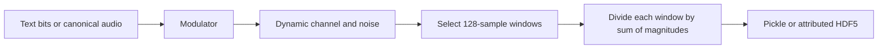

# Generate and validate a RadioML 2016.10a-like dataset

The generator starts from the pinned
[environment reconstruction](historical-environment.md), assigns every random
source an explicit seed, and applies a GNU Radio patch that removes shared
channel RNG state. The output is a new dataset. The distributed dataset's
random states and execution schedule remain unknown.

## Baseline construction

The unit of generation is a finite transmission. The unit of classification is
one 128-sample window from that transmission. Several windows can share a
source, whitening mask, and channel realization.



With every intervention left at its default,
[`generate_RML2016.10a.py`](../generate_RML2016.10a.py) performs these steps:

1. Visit SNR labels in ascending order, then the fixed transmitter order:
   BPSK, QPSK, 8PSK, PAM4, QAM16, QAM64, GFSK, CPFSK, WBFM, AM-DSB, AM-SSB.
2. Start a fresh source and modulator for each transmission. Digital sources
   restart the pinned Shakespeare text, unpack bits least-significant first,
   and XOR them with a new NumPy-drawn, repeating 256-bit mask. Analog sources
   restart the canonical audio at item zero. Source lengths are 10,000 items,
   except 20,000 bits for QAM16 and 30,000 bits for QAM64.
3. Use SPS 8 and RRC roll-off or GFSK BT 0.35 where those parameters apply.
   Pass the waveform through the pinned dynamic channel, including clock drift,
   carrier drift, fading, and additive noise. The channel is parameterized at 200 ksample/s.
   Historical WBFM emits at 220.5 ksample/s, retaining the known mismatch.
   Noise amplitude is `10**(-label/10)`, so labels are not physical SNR.
4. Draw the first post-channel offset uniformly from integers 50 through 500.
   Export a window only while `offset + 128 < transmission_length`. After each
   accepted window, advance by an integer drawn uniformly from 128 through
   `round(0.05 * transmission_length)`, including the draw after the last
   required window. Start another transmission until the key has its requested
   number of windows.
5. Divide each complex window by its L1 magnitude sum, then store its real and
   imaginary parts in `float32[2, 128]`. This is neither unit-energy nor
   unit-RMS normalization. HDF5 additionally retains the divisor and ancestry.

[`source_alphabet.py`](../source_alphabet.py),
[`transmitters.py`](../transmitters.py),
[`dataset_channel.py`](../dataset_channel.py), and
[`dataset_window.py`](../dataset_window.py) implement these stages. The
[seed policy](#seeds) specifies how state advances between transmissions.
Interventions below change one or more stages and must be recorded with the
experiment. Matching seeds alone does not make two different generation
configurations share every latent draw.

## Build and run

From a recursive checkout with Docker and Linux amd64 support:

```sh
docker build --platform linux/amd64 -t radioml2016:historical .
docker build --platform linux/amd64 -f Dockerfile.reproducible \
  -t radioml2016:reproducible .
./build_dataset --python-seed 201610 --numpy-seed 201610 \
  --channel-seed 0x1337 --scheduler sts --output RML2016.10a_dict.dat
```

`build_dataset` mounts the checkout read-write so it can create the requested
output, runs as the caller's UID/GID, and disables networking. Run it from the
repository root. Both image builds are required because the reproducible image
extends the historical candidate. `RML_IMAGE` may select another compatible
image. Preserve the source commit, built-image identity, command line, and
output hash with each generated artifact.

The reproducible-image build converts the MP3 input into a canonical analog
source stream and verifies both files by SHA-256. Generation therefore does
not invoke the MP3 decoder. The historical image retains the original decoder
path for evidence collection.

The default output retains the original pickle protocol 0 and
`dict[(modulation, snr)] -> float32[1000, 2, 128]` layout. Python 3 can read it
using `pickle.load(stream, encoding='latin1')`. For smaller runs, use
`--modulations BPSK QPSK --snrs -20 18 --frames-per-key 80`. SNRs are sorted.
Modulations follow transmitter order, with digital paths before analog paths.
Streams continue across selected keys and transmissions, so a subset run need
not equal slicing a full dataset.

For the representative `--frames-per-key 80 --snrs -20 18` invocation, the
Baseline pickle SHA-256 is
`a1dfcf6d9d5a5e574ad5538ce069a90c7b6b0b0348bc81b9910b640c6c2e928f`.
Adding `--channel-seed-policy advance` produces
`bf8183edabea8e3c608ec5cde7cfa6818187ce999d82dbb7ab3a6ed1def2f697`.
The slow regression requires both literal digests and repeatability across
fresh processes. The [baseline mapper control](../evidence/baseline.json)
used advancing seeds. Changing only its mapper to the October revision
produces the former `c1158937...` fixture. Removing unused generator imports
leaves that January output unchanged. These checks detect changes that
fresh-process repeatability alone would miss. They do not establish that the
selected environment generated the distributed dataset.

Generation selects GNU Radio's single-thread scheduler (`STS`) before any
flowgraph is constructed. The reproducibility fixture requires identical
pickle bytes across fresh STS processes. Use `--scheduler tpb` only to
investigate the historical thread-per-block scheduler (`TPB`). TPB is not part
of the reproducibility guarantee for parameter or seed variations.

## Preserve a review artifact

The [named dataset definitions](datasets.md) specify Baseline, Calibrated, and
Calibrated-VariedAudio, their complete-file hashes, and a regression that
regenerates all four artifacts. The recipe below illustrates provenance
preservation for the Baseline pair. Use the same procedure for the other
profiles.

Use a committed, clean source tree for an artifact submitted for review. Keep
new results under `output/`, separate from the reports retained in `evidence/`.
The following baseline recipe records the commands and produces both the
compatibility pickle and its attributed HDF5 counterpart:

```sh
mkdir -p output/baseline
cat > output/baseline/generate.sh <<'EOF'
#!/bin/sh
set -eu
./build_dataset --python-seed 201610 --numpy-seed 201610 \
  --channel-seed 0x1337 --scheduler sts --frames-per-key 1000 \
  --output output/baseline/RML2016.10a.dat
./build_dataset --python-seed 201610 --numpy-seed 201610 \
  --channel-seed 0x1337 --scheduler sts --frames-per-key 1000 \
  --output-format hdf5 --measure-snr --output output/baseline/RML2016.10a.h5
EOF
sh output/baseline/generate.sh > output/baseline/generation.log 2>&1
```

Require exact I/Q and label equality between the two artifacts:

```sh
docker run --rm --network none --user "$(id -u):$(id -g)" \
  -e HOME=/tmp -e PYTHONDONTWRITEBYTECODE=1 \
  -v "$PWD:/work:ro" -w /work radioml2016:reproducible \
  python2.7 scripts/compare_pickle_hdf5.py \
    output/baseline/RML2016.10a.dat output/baseline/RML2016.10a.h5
```

The comparator loads a trusted pickle, reads HDF5 one key at a time, and fails
on an unsupported schema or a shape, dtype, label, or sample mismatch. Retain
the source identities, source archives, image configuration, and package/build
provenance alongside the data:

```sh
git rev-parse HEAD > output/baseline/source-commit.txt
git submodule status > output/baseline/submodules.txt
git archive --format=tar HEAD > output/baseline/source.tar
git -C source_material archive --format=tar HEAD \
  > output/baseline/source-material.tar
docker image inspect radioml2016:historical radioml2016:reproducible \
  > output/baseline/images.json
docker run --rm --network none --user 0:0 radioml2016:reproducible \
  tar -C /opt -cf - replay-provenance > output/baseline/runtime-provenance.tar
(cd output/baseline && sha256sum RML2016.10a.dat RML2016.10a.h5 \
  generate.sh generation.log source-commit.txt submodules.txt source.tar \
  source-material.tar images.json runtime-provenance.tar > SHA256SUMS)
```

The provenance export uses the container root account to read image-owned
build files. It writes the archive through the caller's shell.

`git archive` records committed files. It does not capture uncommitted edits.
Image configuration identifies an image but does not preserve its layers.
Retain the built images with `docker image save`, or in a registry by digest.
The Dockerfiles pin source commits and direct package versions, but transitive
packages still come from the live Ubuntu archive. Keep the validation reports
described [below](#validation-and-limits) with each reviewed experiment.

## Generator variants

### Canonical analog source

The original continuous-source flowgraph uses the pinned mediatools decoder,
passes its mono `int16` stream through `interleaved_short_to_complex`,
multiplies by `float32(1/65535)`, and retains output zero from
`complex_to_float`. It therefore retains even-indexed mono samples rather than
performing an ordinary mono conversion. The source block emits silence after
end of file, so an unbounded GNU Radio sink cannot be used to discover the
decoded length.

The decoded mono audio is sampled at 44,100 samples/s. Keeping every other
sample leaves 22,050 source items per second of the recording, but all three
analog transmitters interpret those items at 44,100 samples/s. The implied
playback is therefore twice as fast as the decoded recording. This sample
selection applies no antialiasing filter, so source content above 11,025 Hz
can alias before modulation. Freezing the stream preserves both the time-scale
change and any aliasing from that selection. It does not measure how much
high-frequency content the recording contains.

At image-build time,
[`decode_analog_source.cc`](../scripts/decode_analog_source.cc) uses the same
pinned mediatools implementation, stops when its decoder reaches end of file,
and reproduces the even-sample float32 mapping. The verified input and output
are:

| Artifact | Size or count | SHA-256 |
| --- | ---: | --- |
| `serial-s01-e01.mp3` | 25 MiB | `dad05be9b299f3d44bde87d161d525ad0660109ada40b66e33d12999594a069b` |
| Canonical `<f4` stream | 70,056,888 items | `dfa1cdf1d11950f099f685c9c0d2a1197019415ffcf50c8d8f1988dc532a8325` |

The decoder emits 140,113,775 mono shorts. Keeping global even indexes yields
70,056,888 floats, including the final even-indexed sample. The first 10,000
canonical items have SHA-256
`95aa6c9f2aa1ff9cf37df432d6ee47170859cfdef2050ffcc684e5487580e1fa`,
which exactly matches the recorded original flowgraph prefix. Replacing the
runtime decoder with this stream leaves the representative compatibility
pickle hash unchanged.

### Variable analog-source segments

The historical generator reconstructs its audio source for every analog
transmission, so each one starts at canonical source offset zero. Pass
`--vary-analog-source` to use a deterministic permutation of the 7,005 complete
nonoverlapping 10,000-item segments instead:

```sh
./build_dataset --vary-analog-source --analog-source-seed 201610 \
  --output-format hdf5 --output varied-analog.h5
```

The source-selection RNG is independent of Python's global RNG and defaults to
`--seed`. Changing it therefore changes analog source content without changing
SPS, EBW, window-offset, or channel draws. Segment offsets are multiples of
10,000 and no segment is selected twice in one run. The generator reports an
error if it exhausts the source rather than silently reusing a segment.

When the option is absent, every analog source offset remains zero and no
source-selection random values are consumed. This preserves the compatibility
pickle bytes. Use HDF5 to retain source coordinates because the pickle stores
only waveform arrays and labels.

### AM-SSB implementation

The original AM-SSB flowgraph multiplies the signal by a float sine source at
zero frequency. In the pinned GNU Radio runtime that source is only a small
fixed-point residue, so the channel receives almost no modulated signal. This
behavior remains the default for generator compatibility.

Pass `--fixed-am-ssb` to select a minimal repair. The repaired path is identical
to the historical path except that the real zero-frequency oscillator uses
cosine instead of sine. It therefore retains the fractional interpolator,
constant addition, real multiplier, and Hilbert-transform blocks:

```sh
./build_dataset --fixed-am-ssb --seed 201610 --channel-seed 0x1337
```

The defect was introduced by RadioML commit
`c75520108ce85f64dc822b2ac97caa36a872b257`. The cosine change is the minimal
repair implied by the published source and failure mechanism. It is a local
repair, not an upstream patch or a reconstruction of Ramiro Utrilla's
replacement flowgraph. The option changes only the transmitter selected for
the `AM-SSB` keys. The output schema and modulation label remain unchanged, so
record the command line with the generated artifact.

The reproducibility regression subtracts the carrier-only response to silence
from the response to a deterministic 1 kHz message and verifies restored
message transfer. The separate conformance check measures recovered audio and
sideband suppression. The channel control measures the historical SNR-label
semantics.

### Variable digital-transmitter parameters

Pass `--sps MIN MAX` to draw one integer samples-per-symbol value from the
inclusive range for each digital transmission. `MIN` must be at least 1, or at
least 2 when GFSK is selected. Pass `--ebw MIN MAX` to draw one pulse-shaping
parameter uniformly from the closed interval for each compatible digital
transmission. For BPSK, QPSK, 8PSK, PAM4, QAM16, and QAM64, it is the RRC
roll-off (excess bandwidth). For GFSK, it is the Gaussian filter's
bandwidth-symbol-duration product BT. The modulation determines which parameter
`--ebw` controls. The bounds must satisfy `0 < MIN <= MAX <= 1`. CPFSK ignores
this option. The options can be used independently or together:

```sh
./build_dataset --sps 2 12 --ebw 0.1 0.5 \
  --seed 201610 --channel-seed 0x1337
```

Both draws use the Python RNG controlled by `--python-seed`. When an option is
omitted, its parameter keeps the default (SPS 8 or roll-off/BT 0.35) without
additional random values, preserving the default generator's byte output. The
pickle format does not store SPS or EBW metadata. Use the attributed HDF5
output when per-transmission values are required.

### WBFM rate repair

The original WBFM block converts 44.1 ksample/s audio to a 220.5 ksample/s
complex stream, while the channel model is configured for 200 ksample/s. This
mismatch remains the default for generator compatibility. Pass `--fixed-wbfm`
to apply a deterministic 400/441 rational resampler between the modulator and
channel. The repair changes the channel input rate to 200 ksample/s without
changing the native WBFM modulator. It repairs the modulator-to-channel
interface. It leaves the canonical source's twice-speed interpretation and
unfiltered sample selection unchanged, as described under
[canonical analog source](#canonical-analog-source).

### Settled-window sampling

The historical generator draws the first post-channel window offset uniformly
from the inclusive range 50--500. The [filter delay
analysis](filter-delay-analysis.md) establishes that this range begins before
the startup response ends for the six mapper/RRC transmitters, WBFM, and
repaired AM-SSB. Pass `--settled-windows` to shift the lower bound to a
modulation-specific guard:

```sh
./build_dataset --settled-windows --sps 2 12 --ebw 0.1 0.5 \
  --fixed-am-ssb --fixed-wbfm --output settled.dat
```

The repair retains a 451-value inclusive uniform distribution. It therefore
consumes the same single Python RNG draw as the historical sampler. Omitting
the option retains the exact 50--500 bounds and does not change the default
random sequence.

For the six RRC paths, the PFB contains `32*11*SPS` taps. Direct response
probes establish that `11*SPS**2+1` is a conservative first sample beyond its
finite output response. The repair adds the combined channel's measured
five-sample operational response-end displacement, giving
`11*SPS**2+6`. This is 710 samples at the default SPS 8. The RRC and GFSK
structural-support bounds depend on SPS but not EBW. WBFM contains an IIR
preemphasis stage, so its guard uses the documented `1e-7` tail-energy
criterion rather than claiming exact finite support.

The repair uses these post-channel lower bounds:

| Transmitter | Settled-window lower bound |
| --- | ---: |
| BPSK, QPSK, 8PSK, PAM4, QAM16, QAM64 | `max(50, 11*SPS**2+6)` |
| GFSK | `max(50, 5*SPS+5)` |
| CPFSK | `max(50, SPS+6)` |
| Historical WBFM | 318 |
| Rate-repaired WBFM | 260 |
| AM-DSB | 50 |
| Historical AM-SSB | 50 |
| Repaired AM-SSB | 409 |

The five-sample channel term is the maximum operational response-end
displacement measured across the configured baseline, AWGN-equivalent, CFO,
SRO, fading, and combined controls at five input ages. It is an empirical bound
for this pinned channel policy, not a general bound for other GNU Radio channel
models. The historical AM-SSB guard remains 50 because its zero-frequency sine
suppresses the signal before the Hilbert FIR. Its repaired path uses the FIR's
measured finite response boundary.

## Attributed HDF5 output

Pass `--output-format hdf5` to write numeric arrays with window and transmission
provenance. The pickle compatibility format remains the default. When
`--output` is omitted, the HDF5 path defaults to `RML2016.10a.h5`:

```sh
./build_dataset --output-format hdf5 --output RML2016.10a.h5 \
  --sps 2 12 --ebw 0.1 0.5 --fixed-am-ssb --fixed-wbfm \
  --settled-windows
```

The file uses schema `radioml2016-attributed` version 1. The `windows` group
contains these item-aligned datasets:

| Dataset | Dtype and shape | Meaning |
| --- | --- | --- |
| `iq` | `float32[N, 2, 128]` | Normalized I/Q windows with axes `(item, iq, time)` |
| `modulation_id` | `int16[N]` | Index into the root `modulation_names_json` attribute |
| `snr_db` | `int16[N]` | Generator SNR label in dB |
| `transmission_number` | `uint64[N]` | Row in the `transmissions` group |
| `offset` | `uint64[N]` | First window sample in the post-channel transmission |
| `normalization_l1` | `float32[N]` | `sum(abs(raw_window))` divisor applied before storing I/Q |
| `snr_measurement_valid` | `uint8[N]` | One when paired power and SNR values are present |
| `signal_power` | `float64[N]` | Mean clean post-impairment sample power before normalization |
| `noise_power` | `float64[N]` | Mean paired noisy-minus-clean sample power before normalization |
| `measured_snr_db` | `float64[N]` | `10*log10(signal_power/noise_power)` |

The `transmissions` group contains one row for every attempted modulator and
channel execution, including an attempt that contributes no windows. A
transmission number is a zero-based row index and is unique only within one
HDF5 artifact. Window offsets are zero-based indexes into the corresponding
post-channel transmission.

| Dataset | Dtype and shape | Meaning |
| --- | --- | --- |
| `modulation_id` | `int16[T]` | Modulation class for the transmission |
| `snr_db` | `int16[T]` | Generator SNR label in dB |
| `sps` | `uint32[T]` | Actual samples per symbol, or zero when inapplicable |
| `ebw` | `float64[T]` | RRC roll-off for linear modulations, Gaussian-filter BT for GFSK, or NaN when inapplicable |
| `modulator_sample_rate_hz` | `uint32[T]` | Native modulator output rate before an optional repair |
| `channel_input_sample_rate_hz` | `uint32[T]` | Rate of the stream connected to the channel |
| `channel_model_sample_rate_hz` | `uint32[T]` | Rate used to parameterize the channel model |
| `channel_seed` | `uint32[T]` | Actual channel base seed for this transmission |
| `noise_amplitude` | `float64[T]` | Requested RMS amplitude of the complex Gaussian noise source |
| `snr_measurement_valid` | `uint8[T]` | One when aggregate paired measurements are present |
| `signal_power` | `float64[T]` | Aggregate clean power over this row's exported windows |
| `noise_power` | `float64[T]` | Aggregate paired residual power over this row's exported windows |
| `measured_snr_db` | `float64[T]` | Aggregate measured SNR before normalization |
| `snr_measurement_window_count` | `uint32[T]` | Number of exported windows used in the aggregate |
| `sample_count` | `uint64[T]` | Post-channel transmission length in samples |
| `analog_source_valid` | `uint8[T]` | One when the row uses the canonical analog source |
| `analog_source_offset` | `uint64[T]` | First pre-modulator canonical source item |
| `analog_source_length` | `uint32[T]` | Number of canonical source items consumed |
| `random_mask` | `uint8[T, 256]` | Repeated discrete-source whitening mask |
| `random_mask_valid` | `uint8[T]` | One when `random_mask` applies |
| `am_ssb_fixed` | `uint8[T]` | One for the local fixed AM-SSB implementation |
| `wbfm_fixed` | `uint8[T]` | One when WBFM is resampled to 200 ksample/s |
| `settling_guard_samples` | `uint32[T]` | First-offset lower bound recommended by the startup policy |

All windows with the same `transmission_number` share one source, modulator,
parameter set, and channel execution. Keep such windows in the same data split.
With `restart`, different transmissions also reuse channel evolution and noise
sequences before amplitude scaling. They can share source content as well.
Baseline has exact duplicate windows under different transmission IDs, so
transmission grouping alone does not prevent leakage. See the
[dependence audit](datasets.md#dependence-and-evaluation-splits) for the measured
counts and requirements for a held-out channel study. The exact mask permits
reconstruction of the whitened discrete input. Analog transmissions have a
zero mask and `random_mask_valid=0`.

The root `analog_source_json` attribute identifies the canonical source by
dtype, item count, SHA-256, and coordinate definition. For digital rows,
`analog_source_valid=0` and the offset and length are zero. Without
`--vary-analog-source`, all analog rows have offset zero and length 10,000.
With it, valid offsets are distinct multiples of 10,000. The root
`generation_options_json` records the option and `analog_source_seed`.

The root `generation_options_json` attribute records `snr_mode` and whether
`measure_snr` and `settled_windows` were enabled. When `settled_windows` is
true, every window offset is at least the referenced transmission's
`settling_guard_samples`. When it is false, the guard still records the
analyzed boundary so downstream code can identify historical startup windows
with `offset < settling_guard_samples`.

`normalization_l1` is always present. Multiplying stored complex I/Q by this
value reconstructs the raw post-channel window up to float32 arithmetic.
Measurement arrays contain NaN and their validity flag is zero when no paired
run was performed. Calibrated mode always performs paired runs, even without
`--measure-snr`. A transmission with an invalid measurement has a zero
measurement-window count.

The original WBFM path records native and channel-input rates of 220,500
samples/s and a channel-model rate of 200,000 samples/s. With `--fixed-wbfm`,
the native rate remains 220,500 samples/s and the channel-input rate becomes
200,000 samples/s. Other transmitters record 200,000 samples/s for all three
rates.

Run `scripts/compare_pickle_hdf5.py PICKLE HDF5` in the reproducible image to
require exact I/Q equality and aligned modulation and SNR labels. The comparator
loads the pickle, which must come from a trusted source, but reads HDF5 I/Q one
`(modulation, SNR)` batch at a time. It rejects unsupported schema versions and
exits nonzero on any shape, dtype, label, or sample mismatch.

The image pins `h5py` 2.6.0, HDF5 1.8.16, and pytest 2.8.7. Their package and
runtime versions are recorded under `/opt/replay-provenance`. The
reproducibility check compares complete HDF5 file hashes across fresh generator
processes and validates the alignment and applicability of every attribute. It
also writes `reproducibility-matrix.json`, including generation arguments,
whole-file hashes, runtime provenance, and per-array HDF5 fingerprints for a
downstream import check. These fixtures use STS. The HDF5 schema records the
selected scheduler and does not prohibit TPB, whose parameter and seed
variations remain outside the reproducibility guarantee.

## SNR-label semantics

The generator provides three explicit interpretations of `snr_db`:

| `--snr-mode` | Noise amplitude | Meaning |
| --- | --- | --- |
| `historical` | `10**(-label/10)` | Original implementation; noise power changes 2 dB per 1 dB label step |
| `scaled` | `10**(-label/20)` | Correct dB-to-amplitude slope, assuming unit signal and unit-noise power |
| `calibrated` | Measured per transmission | Target aggregate SNR over the windows exported from that transmission |

`historical` is the default and preserves the compatibility pickle. `scaled`
fixes the dimensional error but does not make the label an accurate SNR when
the signal path or unit-noise realization has nonunit power.

`calibrated` first materializes the exact finite waveform presented to the
channel. It runs that waveform and channel seed with zero noise to obtain
clean post-impairment samples and with unit-amplitude noise to obtain the
realized noise residual. For selected windows with aggregate clean power
`P_signal` and unit-noise power `P_noise,1`, it requests

```text
sqrt(P_signal / (P_noise,1 * 10**(label/10))).
```

The final channel run uses the same input and seed. This targets the label over
the exact exported windows and includes fading, filter startup if selected,
and modulation-dependent power. Signal power means the complete complex RF
waveform, including an AM carrier. It does not isolate the information-bearing
sideband, so a carrier-to-sideband or demodulated quality metric remains a
separate measurement.

Pass `--measure-snr` with `--output-format hdf5` to record the paired powers
and their ratio without changing the selected noise policy. For historical and
scaled modes, the generator first completes the normal noisy flowgraph, then
reconstructs its finite channel input from the recorded whitening mask or
canonical analog-source coordinates and runs a zero-noise channel with the
same seed. The HDF5 I/Q remains exactly equal to an otherwise identical pickle
run. Calibrated mode already has the zero-noise run and always records its
measurements. Per-window values describe one 128-sample interval. Transmission
values aggregate all exported windows from that channel execution.

The stored powers precede per-window L1 normalization. The normalization would
scale signal and noise equally and therefore cancel in their ratio, but the
recorded divisor permits amplitude-sensitive analysis and reconstruction of
the unnormalized window.

`tests/check_channel_controls.py` isolates AWGN, carrier drift, sample-rate
drift, and fading, then exercises their supported combination. For its
deterministic BPSK control, labels -20, 0, and 18 measure approximately -34.65,
5.35, and 41.35 dB after the signal path. These are measurements of that
control, not universal corrections for the dataset labels.

The same control demodulates 512 BPSK symbols without error in the baseline,
each isolated impairment, and the combined channel at label 18. It also selects
four normalized windows from a real post-channel transmission by their recorded
zero-based offsets and requires exact sample equality.

## Seeds

| Option | Default and purpose |
| --- | --- |
| `--seed` | `201610`; supplies Python and NumPy defaults |
| `--python-seed` | Overrides sampler positions and, when enabled, SPS/EBW draws |
| `--numpy-seed` | Overrides the digital source masks; analog sources draw no mask |
| `--channel-seed` | `0x1337` (4919); channel base seed |
| `--channel-seed-policy` | `restart`; reuse the base for each transmission, or `advance` to change it |
| `--analog-source-seed` | Defaults to `--seed`; permutes analog source segments when enabled |

Python, NumPy, and analog-source seeds accept `0..4294967295`. Channel seeds
accept `1..2147483644`. GNU Radio treats zero as a time seed. With the default
`--channel-seed-policy restart`, every transmission uses the supplied base
seed. This follows the published generator's repeated `0x1337` constructor
argument. In the patched runtime it also restarts the private channel streams,
so equal-length transmissions share the same channel evolution and noise
sequence before amplitude scaling. It does not recover the original shared
RNG interleaving.

With `--channel-seed-policy advance`, transmission `b`, counted from zero
across the run, uses
`base = 1 + ((channel_seed - 1 + 4*b) % 2147483644)`. The base advances across
modulation and SNR boundaries and wraps within the supported range. This
changes fading, drift, and noise realizations. It is independent of the
analog-source selection option and does not establish statistical independence
between transmissions.

Under either policy, AWGN uses `base`, sample-rate drift uses `base+1`,
carrier-frequency drift uses `base+2`, and fading path `i` uses angle seed
`base+i` and walk seed `base+i+1`. Paired clean, unit-noise, and final runs of
one transmission reuse its base seed. Advancing applies once per transmission,
not once per measurement run.

HDF5 records `channel_seed_policy` and `initial_channel_seed` in
`generation_options_json`, together with each transmission's actual
`channel_seed`. Earlier schema-version-1 files omit `channel_seed_policy`
and used `advance`. Interpret a missing field in those files as `advance`,
not as the command-line default.

## Deterministic evaluation

The [GNU Radio patch](../patches/gnuradio-3.7.10.1-fastnoise.patch) gives each
fast-noise instance private `drand48_data` state. It retains the historical
Gaussian pool construction and 48-bit recurrence, makes the pool/sign draw
order explicit, and assigns different seeds to clock and carrier drift.
Thread scheduling no longer assigns shared random draws to channel components.
This changes their joint random process from the original implementation.

Private RNG state is necessary but not sufficient for every TPB execution.
Different finite-stream work schedules can change a later transmission when
generation parameters alter source or sampler behavior. STS fixes the block
execution order and is therefore part of the reproducibility contract.

By default, the generator retains the original loop order, source lengths,
modulators, channel parameters apart from seeds, window sampling, and
normalization by `sum(abs(window))`. CLI parsing and runtime checks live in
[generator_options.py](../generator_options.py). Source and transmitter code
retain their historical defaults. The image sets `PYTHONHASHSEED=0`,
`VOLK_GENERIC=1`, `OMP_NUM_THREADS=1`, `OPENBLAS_NUM_THREADS=1`, and the
canonical analog-source path before Python starts. The helper requires these
settings, the verified source size, Python 2.7, and the patched runtime marker.

## Validation and limits

Run all validation checks against a read-only checkout:

```sh
docker run --rm --network none --user "$(id -u):$(id -g)" \
  -e HOME=/tmp -e PYTHONDONTWRITEBYTECODE=1 \
  -v "$PWD:/work:ro" -w /work \
  radioml2016:reproducible \
  python2.7 -m pytest -q tests
```

The suite has eight modules:

| Test | Contract |
| --- | --- |
| `check_modulators.py` | Clean message recovery and modulation properties |
| `check_channel_controls.py` | Channel impairments, SNR labels, and window offsets |
| `check_datasets.py` | Full named-dataset hashes and exact Baseline pickle/HDF5 equality |
| `check_dataset_quality.py` | Exact duplicate counts, key separation, and duplicate ancestry |
| `check_filter_delay.py` | Startup measurements and sampling guards |
| `check_mapper_snr.py` | Calibrated SNR estimation, model selection, and report provenance |
| `check_reproducibility.py` | Fresh-process byte identity, seed controls, variants, and metadata |
| `check_snr_policy.py` | Historical scaling, corrected scaling, and paired calibration |

The slow [reproducibility test](../tests/check_reproducibility.py) compares
three fresh default STS processes across all 11 modulations at SNRs -20 and 18
with 80 windows per key, exercising multiple transmissions. It compares the
default with explicit STS and restart settings, checks advancing seeds and
wraparound, and exercises the historical TPB fixture. It repeats runs with
independent Python, NumPy, and channel seed changes and rejects unsupported
parameters and runtime settings. It also checks AM-SSB message transfer,
repeats generations using all three repair options and all three SNR policies,
and verifies that SPS and EBW variation are independently effective and jointly
byte-reproducible. It also requires every settled-window offset to meet its
recorded guard. Run only this test with
`python2.7 -m pytest -q tests/check_reproducibility.py`. The matrix also varies
the analog source, requires different source seeds to change its output,
checks that selected segments do not overlap, compares measured HDF5 I/Q
exactly with its pickle counterpart, and repeats the attributed HDF5 bytes.

Pytest creates the matrix artifacts under its temporary directory. The
container removes that directory after the test. Retain the generated pickle
and HDF5 files, subprocess logs, hashes, and `reproducibility-matrix.json` with
the direct reporting interface:

```sh
mkdir -p output/reproducibility
docker run --rm --network none --user "$(id -u):$(id -g)" \
  -e HOME=/tmp -e PYTHONDONTWRITEBYTECODE=1 \
  -v "$PWD:/work:ro" -v "$PWD/output/reproducibility:/out" -w /work \
  radioml2016:reproducible \
  python2.7 tests/check_reproducibility.py --output /out
```

Run the separate [modulator conformance check](modulator-conformance.md) to
demodulate clean outputs from all eleven transmitters. That check tests message
recovery and modulation-specific signal properties. Byte identity and
performance under channel impairments require separate checks.

`tests/check_channel_controls.py` complements the clean-modulator check with
isolated and combined deterministic impairments, SNR-label measurements, and
exact post-channel offset reconstruction. The separate [filter delay
analysis](filter-delay-analysis.md) measures cold-start responses for all
transmitters and local delay for each channel control. It establishes that the
historical 50--500 first-window offset does not reliably skip transmitter
startup. These focused tests run by default. Exclude the slow matrix and full
dataset regeneration with
`python2.7 -m pytest -q -m 'not slow' tests`.

Byte identity applies to the tested Linux amd64 image, source inputs, and
execution settings. Other architectures or rebuilt dependencies may differ.
The environment-reconstruction image preserves GNU Radio's shared RNG for the
evidence investigation. Explicit seeds alone do not make that runtime
deterministic.

### Manual validation

Run validation explicitly from the repository root on the `dev` branch.
[`scripts/validate.sh`](../scripts/validate.sh) runs the existing checks and
retains their output. The repository has no GitHub Actions workflows and
does not require Docker Hub credentials.

For a fresh environment validation, use a clean, committed recursive checkout
and a new output directory. The following Bash commands rebuild both images
without a build cache, retaining their build logs. The base image remains
pinned by digest in `Dockerfile`.

```bash
set -euo pipefail
validation_output=output/validation-$(date -u +%Y%m%dT%H%M%SZ)
mkdir -p "$validation_output/reports"
git rev-parse HEAD > "$validation_output/reports/build-source-commit.txt"
git status --porcelain=v1 > "$validation_output/reports/build-source-status.txt"
docker build --platform linux/amd64 --no-cache --pull --progress plain \
  -t radioml2016:historical . \
  2>&1 | tee "$validation_output/reports/build-historical.log"
docker image inspect radioml2016:historical \
  > "$validation_output/reports/historical-image.json"
docker build --platform linux/amd64 --no-cache --progress plain \
  -f Dockerfile.reproducible -t radioml2016:reproducible . \
  2>&1 | tee "$validation_output/reports/build-reproducible.log"
bash scripts/validate.sh full radioml2016:reproducible "$validation_output"
```

The full invocation runs the fast pytest suite, then both slow reporting
interfaces: full named-dataset regeneration and the reproducibility matrix.
It requires all four reference SHA-256 hashes and exact Baseline pickle/HDF5
I/Q and label equality. If a slow check fails, the other still runs and the
wrapper exits with a failure status. A failed fast suite stops the run.
The checks do not update reference hashes.

To run only the fast suite against an existing local image, use a different
output directory:

```sh
bash scripts/validate.sh fast radioml2016:reproducible output/validation-fast
```

Validation containers have no network access and mount the checkout read-only.
Generated data stays under `data/`. The `reports/` directory retains the source
commit and working-tree status, submodule identities, host and image details,
runtime provenance, test logs, JSON reports, and actual generated-file hashes.
`exit-code.txt` records the wrapper's result. A failed run may leave incomplete
artifacts or omit a final JSON report, so inspect the exit status and logs as
well. The wrapper refuses to reuse an existing `data/` directory.

Retain the images locally with `docker image save` alongside the reports when
preserving a reviewed validation run. Rebuilt image IDs may differ because
image metadata and transitive packages are not fully frozen. Successful
validation establishes the documented generation contract for the recorded
environment. It does not establish equivalence to the original RadioML arrays.
